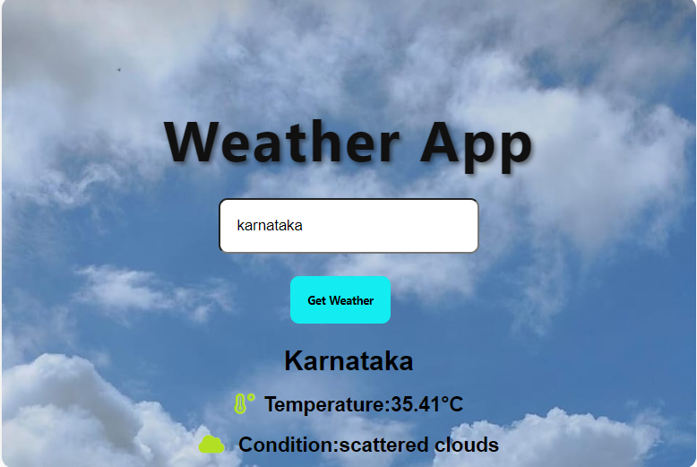

🌤️ Weather App

Get real-time weather updates by simply entering the name of a state. This simple and stylish weather app displays current conditions using data fetched from the OpenWeatherMap API, all wrapped in a clean and responsive design built with HTML, CSS, and JavaScript.

✨ Features
🔍 Search by state
🌡️ Real-time temperature, weather conditions, and more
🌐 Powered by OpenWeatherMap API
💻 Clean and responsive UI
⚡ Fast and lightweight

📸 Screenshots

🛠️ Tech Stack

Frontend: HTML, CSS, JavaScript
API: [OpenWeatherMap](https://openweathermap.org/)

